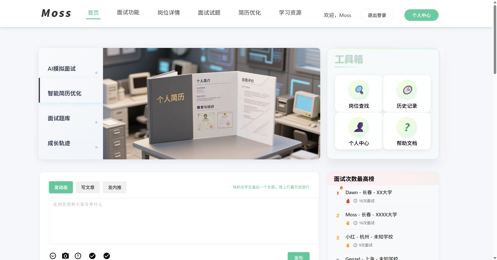

# 多模态模拟面试测评智能体MOSS
## 一、介绍：
MOSS 多模态智能模拟面试评测系统 是一款专为高校学生设计的智能化面试训练与评测平台。该系统深度融合了讯飞星火大模型和讯飞数字人技术，旨在解决高校毕业生在求职过程中面临的面试经验不足、岗位认知模糊、表达能力欠缺等核心痛点。通过构建一个集模拟训练、多维度评测、个性化提升于一体的全闭环面试能力培养体系，MOSS 致力于帮助学生高效提升面试竞争力，实现从校园到职场的平稳过渡。

## 二、实现功能

#### 1.沉浸式模拟面试：

>为用户提供与真实面试场景高度一致的对话体验。

#### 2.实时情绪分析：

>在模拟面试过程中，系统能够实时分析用户的情绪状态。

#### 3.多维度反馈与报告： 

>收集用户在模拟面试过程中的文本、语音、视频数据，对回答的准确性和情绪进行综合分析，并最终生成详细的反馈报告。

#### 4.可视化数据呈现： 

>通过雷达图、情绪波动图等多种可视化形式，直观展示用户的面试表现，并提供有针对性的改进建议。

#### 5.个性化学习资源推荐： 

>根据面试反馈报告揭示的薄弱点，系统可生成相应的知识图谱，并推荐学习资料，帮助用户弥补知识短板。

#### 6.面试历史与成长轨迹： 

>用户可以随时查看过往的面试历史记录，并追踪个人能力成长的轨迹。

#### 7.岗位信息与模拟面试： 

>提供企业招聘信息板块，用户可在此查找心仪的岗位并进行针对性的模拟面试。

#### 8.定制化刷题训练： 

>用户可以根据不同的岗位和岗位需求，生成定制化的面试试题进行专项训练。

#### 9.智能简历优化： 

>在简历优化板块，用户可以根据不同的岗位和岗位需求，获得有针对性的简历优化建议。

## 三、项目展示

该项目部署在 https://www.moss-interviewer.website/

可通过下面的账号密码进行测试
>- 账号：Moss
>- 密码：123456

## 四、运行项目

### 前置条件

在运行之前，请确保您的计算机已安装以下软件和工具：
>- Python 3.12
>- MySQL
>- neo4j
>- ffmpeg
>- 讯飞星火大模型 API 密钥和应用 ID
>- 讯飞数字人 API

### 运行步骤

> 见web和server目录下的README.md文件

